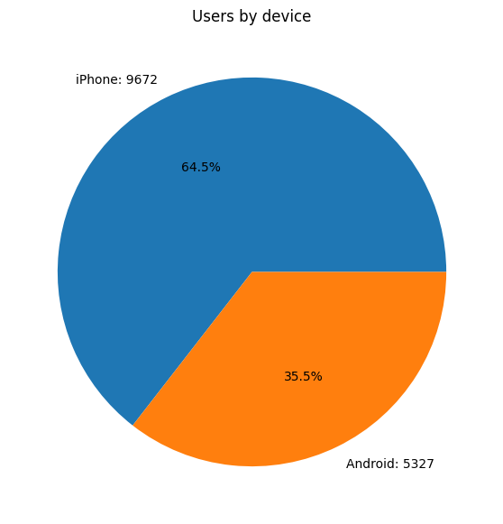
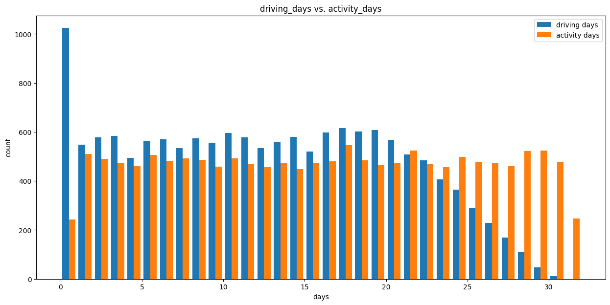
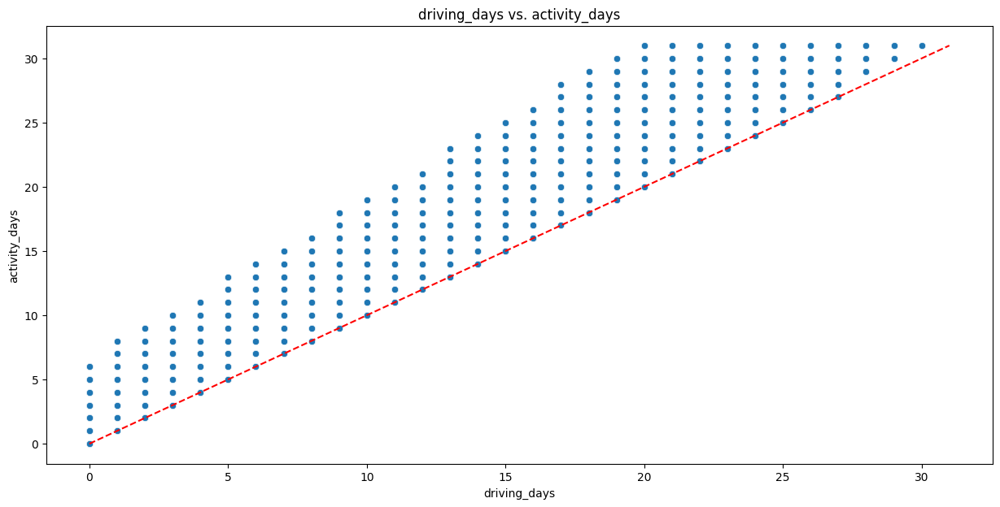
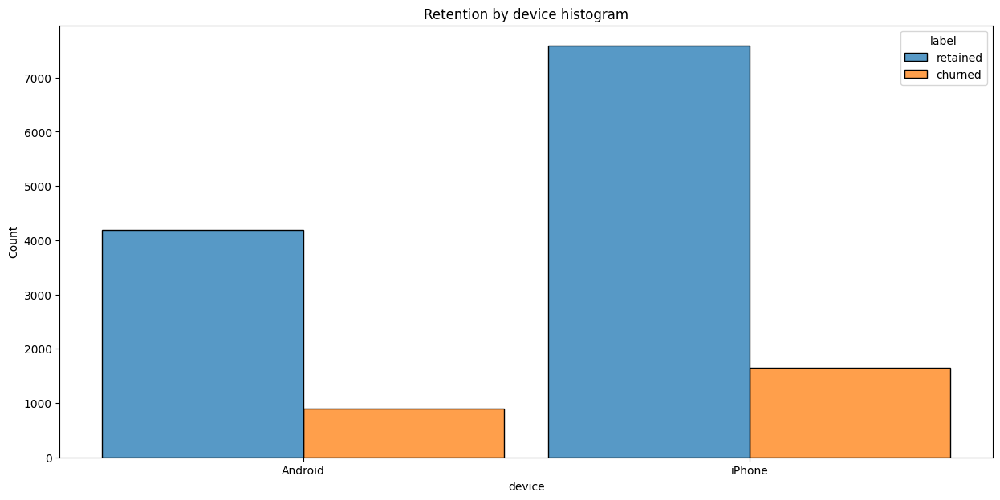
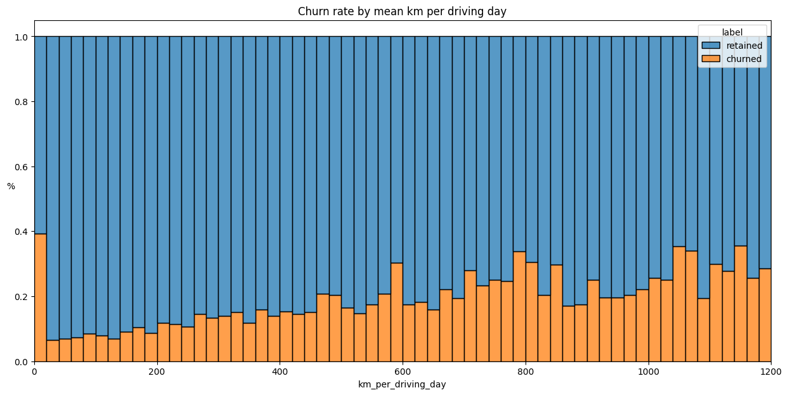

# **Waze Project**

Welcome to the Waze Project!

#### Case Study:

Waze data analytics team is still in the early stages of their user churn project. Previously, you were asked to complete a project proposal by your supervisor, May Santner. You have received notice that your project proposal has been approved and that your team has been given access to Waze's user data. To get clear insights, the user data must be inspected and prepared for the upcoming process of exploratory data analysis (EDA).

# **Inspect and analyze data**


**The purpose** of this project is to investigate and understand the data provided.

**The goal** is to use a dataframe contructed within Python, perform a cursory inspection of the provided dataset, and inform team members of your findings.
<br/>

*This activity has three parts:*

**Part 1:** Understand the situation
* How can you best prepare to understand and organize the provided information?

**Part 2:** Understand the data

* Create a pandas dataframe for data learning, future exploratory data analysis (EDA), and statistical activities

* Compile summary information about the data to inform next steps

**Part 3:** Understand the variables

* Use insights from your examination of the summary data to guide deeper investigation into variables


<br/>


# **Identify data types and compile summary information**


### **Understand the situation**

#### How can you best prepare to understand and organize the provided driver data?

●	Who is your audience for this project? 

    Waze data team and cross-functional team members.

●	What are you trying to solve or accomplish? And, what do you anticipate the impact of this work will be on the larger needs of the client? 

    Develop a machine learning model to predict user churn.

●	What questions need to be asked or answered?

    What is the condition of the provided dataset? 
    What variables will be the most useful? 
    Are there trends within the data that can provide insight? 
    What steps can I take to reduce the impact of bias?

●	What resources are required to complete this project? 

    Project dataset, Python notebook, and input from stakeholders.

●	What are the deliverables that will need to be created over the course of this project? 

    Dataset scrubbed for exploratory data analysis, visualizations, statistical model, regression analysis and/or machine learning model.

### **Imports and data loading**


```python
# Import packages for data manipulation
import pandas as pd
import numpy as np
```


```python
import warnings
warnings.filterwarnings("ignore")
```


```python
# Load dataset into dataframe
df = pd.read_csv('waze_dataset.csv')
```

### **Summary information**

*Answering following questions:*

1. When reviewing the `df.head()` output, are there any variables that have missing values?

2. When reviewing the `df.info()` output, what are the data types? How many rows and columns do you have?

3. Does the dataset have any missing values?


```python
df.head(10)
```


<div>
 
<table border="1" class="dataframe">
  <thead>
    <tr style="text-align: right;">
      <th></th>
      <th>ID</th>
      <th>label</th>
      <th>sessions</th>
      <th>drives</th>
      <th>total_sessions</th>
      <th>n_days_after_onboarding</th>
      <th>total_navigations_fav1</th>
      <th>total_navigations_fav2</th>
      <th>driven_km_drives</th>
      <th>duration_minutes_drives</th>
      <th>activity_days</th>
      <th>driving_days</th>
      <th>device</th>
    </tr>
  </thead>
  <tbody>
    <tr>
      <th>0</th>
      <td>0</td>
      <td>retained</td>
      <td>283</td>
      <td>226</td>
      <td>296.748273</td>
      <td>2276</td>
      <td>208</td>
      <td>0</td>
      <td>2628.845068</td>
      <td>1985.775061</td>
      <td>28</td>
      <td>19</td>
      <td>Android</td>
    </tr>
    <tr>
      <th>1</th>
      <td>1</td>
      <td>retained</td>
      <td>133</td>
      <td>107</td>
      <td>326.896596</td>
      <td>1225</td>
      <td>19</td>
      <td>64</td>
      <td>13715.920550</td>
      <td>3160.472914</td>
      <td>13</td>
      <td>11</td>
      <td>iPhone</td>
    </tr>
    <tr>
      <th>2</th>
      <td>2</td>
      <td>retained</td>
      <td>114</td>
      <td>95</td>
      <td>135.522926</td>
      <td>2651</td>
      <td>0</td>
      <td>0</td>
      <td>3059.148818</td>
      <td>1610.735904</td>
      <td>14</td>
      <td>8</td>
      <td>Android</td>
    </tr>
    <tr>
      <th>3</th>
      <td>3</td>
      <td>retained</td>
      <td>49</td>
      <td>40</td>
      <td>67.589221</td>
      <td>15</td>
      <td>322</td>
      <td>7</td>
      <td>913.591123</td>
      <td>587.196542</td>
      <td>7</td>
      <td>3</td>
      <td>iPhone</td>
    </tr>
    <tr>
      <th>4</th>
      <td>4</td>
      <td>retained</td>
      <td>84</td>
      <td>68</td>
      <td>168.247020</td>
      <td>1562</td>
      <td>166</td>
      <td>5</td>
      <td>3950.202008</td>
      <td>1219.555924</td>
      <td>27</td>
      <td>18</td>
      <td>Android</td>
    </tr>
    <tr>
      <th>5</th>
      <td>5</td>
      <td>retained</td>
      <td>113</td>
      <td>103</td>
      <td>279.544437</td>
      <td>2637</td>
      <td>0</td>
      <td>0</td>
      <td>901.238699</td>
      <td>439.101397</td>
      <td>15</td>
      <td>11</td>
      <td>iPhone</td>
    </tr>
    <tr>
      <th>6</th>
      <td>6</td>
      <td>retained</td>
      <td>3</td>
      <td>2</td>
      <td>236.725314</td>
      <td>360</td>
      <td>185</td>
      <td>18</td>
      <td>5249.172828</td>
      <td>726.577205</td>
      <td>28</td>
      <td>23</td>
      <td>iPhone</td>
    </tr>
    <tr>
      <th>7</th>
      <td>7</td>
      <td>retained</td>
      <td>39</td>
      <td>35</td>
      <td>176.072845</td>
      <td>2999</td>
      <td>0</td>
      <td>0</td>
      <td>7892.052468</td>
      <td>2466.981741</td>
      <td>22</td>
      <td>20</td>
      <td>iPhone</td>
    </tr>
    <tr>
      <th>8</th>
      <td>8</td>
      <td>retained</td>
      <td>57</td>
      <td>46</td>
      <td>183.532018</td>
      <td>424</td>
      <td>0</td>
      <td>26</td>
      <td>2651.709764</td>
      <td>1594.342984</td>
      <td>25</td>
      <td>20</td>
      <td>Android</td>
    </tr>
    <tr>
      <th>9</th>
      <td>9</td>
      <td>churned</td>
      <td>84</td>
      <td>68</td>
      <td>244.802115</td>
      <td>2997</td>
      <td>72</td>
      <td>0</td>
      <td>6043.460295</td>
      <td>2341.838528</td>
      <td>7</td>
      <td>3</td>
      <td>iPhone</td>
    </tr>
  </tbody>
</table>
</div>


```python
df.info()
```

    <class 'pandas.core.frame.DataFrame'>
    RangeIndex: 14999 entries, 0 to 14998
    Data columns (total 13 columns):
     #   Column                   Non-Null Count  Dtype  
    ---  ------                   --------------  -----  
     0   ID                       14999 non-null  int64  
     1   label                    14299 non-null  object 
     2   sessions                 14999 non-null  int64  
     3   drives                   14999 non-null  int64  
     4   total_sessions           14999 non-null  float64
     5   n_days_after_onboarding  14999 non-null  int64  
     6   total_navigations_fav1   14999 non-null  int64  
     7   total_navigations_fav2   14999 non-null  int64  
     8   driven_km_drives         14999 non-null  float64
     9   duration_minutes_drives  14999 non-null  float64
     10  activity_days            14999 non-null  int64  
     11  driving_days             14999 non-null  int64  
     12  device                   14999 non-null  object 
    dtypes: float64(3), int64(8), object(2)
    memory usage: 1.5+ MB
    

### 1. Reviewing df.head() for Missing Values:

None of the variables in the first 10 observations have missing values. Note that this does not imply the whole dataset does not have any missing values.

### 2. Reviewing df.info() for Data Types and Shape:

`Data types:`

`int64:` 8 columns (ID, sessions, drives, n_days_after_onboarding, total_navigations_fav1, total_navigations_fav2, activity_days, driving_days)

`float64:` 3 columns (total_sessions, driven_km_drives, duration_minutes_drives)

`object:` 2 columns (label, device)

`Number of rows:` 14,999

`Number of columns:` 13

### 3. Checking for Missing Values:

Yes, the dataset does have missing values. Specifically, the label column has 14,299 non-null values out of 14,999, indicating that there are `700` missing values in this column. All other columns have no missing values, with each having 14,999 non-null entries.

### **Null values and summary statistics**

Compare the summary statistics of the 700 rows that are missing labels with summary statistics of the rows that are not missing any values.

**Question:** Is there a discernible difference between the two populations?


```python
# Isolate rows with null values
null_df = df[df['label'].isnull()]
# Display summary stats of rows with null values
null_df.describe()
```


<div>
 
<table border="1" class="dataframe">
  <thead>
    <tr style="text-align: right;">
      <th></th>
      <th>ID</th>
      <th>sessions</th>
      <th>drives</th>
      <th>total_sessions</th>
      <th>n_days_after_onboarding</th>
      <th>total_navigations_fav1</th>
      <th>total_navigations_fav2</th>
      <th>driven_km_drives</th>
      <th>duration_minutes_drives</th>
      <th>activity_days</th>
      <th>driving_days</th>
    </tr>
  </thead>
  <tbody>
    <tr>
      <th>count</th>
      <td>700.000000</td>
      <td>700.000000</td>
      <td>700.000000</td>
      <td>700.000000</td>
      <td>700.000000</td>
      <td>700.000000</td>
      <td>700.000000</td>
      <td>700.000000</td>
      <td>700.000000</td>
      <td>700.000000</td>
      <td>700.000000</td>
    </tr>
    <tr>
      <th>mean</th>
      <td>7405.584286</td>
      <td>80.837143</td>
      <td>67.798571</td>
      <td>198.483348</td>
      <td>1709.295714</td>
      <td>118.717143</td>
      <td>30.371429</td>
      <td>3935.967029</td>
      <td>1795.123358</td>
      <td>15.382857</td>
      <td>12.125714</td>
    </tr>
    <tr>
      <th>std</th>
      <td>4306.900234</td>
      <td>79.987440</td>
      <td>65.271926</td>
      <td>140.561715</td>
      <td>1005.306562</td>
      <td>156.308140</td>
      <td>46.306984</td>
      <td>2443.107121</td>
      <td>1419.242246</td>
      <td>8.772714</td>
      <td>7.626373</td>
    </tr>
    <tr>
      <th>min</th>
      <td>77.000000</td>
      <td>0.000000</td>
      <td>0.000000</td>
      <td>5.582648</td>
      <td>16.000000</td>
      <td>0.000000</td>
      <td>0.000000</td>
      <td>290.119811</td>
      <td>66.588493</td>
      <td>0.000000</td>
      <td>0.000000</td>
    </tr>
    <tr>
      <th>25%</th>
      <td>3744.500000</td>
      <td>23.000000</td>
      <td>20.000000</td>
      <td>94.056340</td>
      <td>869.000000</td>
      <td>4.000000</td>
      <td>0.000000</td>
      <td>2119.344818</td>
      <td>779.009271</td>
      <td>8.000000</td>
      <td>6.000000</td>
    </tr>
    <tr>
      <th>50%</th>
      <td>7443.000000</td>
      <td>56.000000</td>
      <td>47.500000</td>
      <td>177.255925</td>
      <td>1650.500000</td>
      <td>62.500000</td>
      <td>10.000000</td>
      <td>3421.156721</td>
      <td>1414.966279</td>
      <td>15.000000</td>
      <td>12.000000</td>
    </tr>
    <tr>
      <th>75%</th>
      <td>11007.000000</td>
      <td>112.250000</td>
      <td>94.000000</td>
      <td>266.058022</td>
      <td>2508.750000</td>
      <td>169.250000</td>
      <td>43.000000</td>
      <td>5166.097373</td>
      <td>2443.955404</td>
      <td>23.000000</td>
      <td>18.000000</td>
    </tr>
    <tr>
      <th>max</th>
      <td>14993.000000</td>
      <td>556.000000</td>
      <td>445.000000</td>
      <td>1076.879741</td>
      <td>3498.000000</td>
      <td>1096.000000</td>
      <td>352.000000</td>
      <td>15135.391280</td>
      <td>9746.253023</td>
      <td>31.000000</td>
      <td>30.000000</td>
    </tr>
  </tbody>
</table>
</div>


```python
# Isolate rows without null values
not_null_df = df[~df['label'].isnull()]
# Display summary stats of rows without null values
not_null_df.describe()
```


<div>
 
<table border="1" class="dataframe">
  <thead>
    <tr style="text-align: right;">
      <th></th>
      <th>ID</th>
      <th>sessions</th>
      <th>drives</th>
      <th>total_sessions</th>
      <th>n_days_after_onboarding</th>
      <th>total_navigations_fav1</th>
      <th>total_navigations_fav2</th>
      <th>driven_km_drives</th>
      <th>duration_minutes_drives</th>
      <th>activity_days</th>
      <th>driving_days</th>
    </tr>
  </thead>
  <tbody>
    <tr>
      <th>count</th>
      <td>14299.000000</td>
      <td>14299.000000</td>
      <td>14299.000000</td>
      <td>14299.000000</td>
      <td>14299.000000</td>
      <td>14299.000000</td>
      <td>14299.000000</td>
      <td>14299.000000</td>
      <td>14299.000000</td>
      <td>14299.000000</td>
      <td>14299.000000</td>
    </tr>
    <tr>
      <th>mean</th>
      <td>7503.573117</td>
      <td>80.623820</td>
      <td>67.255822</td>
      <td>189.547409</td>
      <td>1751.822505</td>
      <td>121.747395</td>
      <td>29.638296</td>
      <td>4044.401535</td>
      <td>1864.199794</td>
      <td>15.544653</td>
      <td>12.182530</td>
    </tr>
    <tr>
      <th>std</th>
      <td>4331.207621</td>
      <td>80.736502</td>
      <td>65.947295</td>
      <td>136.189764</td>
      <td>1008.663834</td>
      <td>147.713428</td>
      <td>45.350890</td>
      <td>2504.977970</td>
      <td>1448.005047</td>
      <td>9.016088</td>
      <td>7.833835</td>
    </tr>
    <tr>
      <th>min</th>
      <td>0.000000</td>
      <td>0.000000</td>
      <td>0.000000</td>
      <td>0.220211</td>
      <td>4.000000</td>
      <td>0.000000</td>
      <td>0.000000</td>
      <td>60.441250</td>
      <td>18.282082</td>
      <td>0.000000</td>
      <td>0.000000</td>
    </tr>
    <tr>
      <th>25%</th>
      <td>3749.500000</td>
      <td>23.000000</td>
      <td>20.000000</td>
      <td>90.457733</td>
      <td>878.500000</td>
      <td>10.000000</td>
      <td>0.000000</td>
      <td>2217.319909</td>
      <td>840.181344</td>
      <td>8.000000</td>
      <td>5.000000</td>
    </tr>
    <tr>
      <th>50%</th>
      <td>7504.000000</td>
      <td>56.000000</td>
      <td>48.000000</td>
      <td>158.718571</td>
      <td>1749.000000</td>
      <td>71.000000</td>
      <td>9.000000</td>
      <td>3496.545617</td>
      <td>1479.394387</td>
      <td>16.000000</td>
      <td>12.000000</td>
    </tr>
    <tr>
      <th>75%</th>
      <td>11257.500000</td>
      <td>111.000000</td>
      <td>93.000000</td>
      <td>253.540450</td>
      <td>2627.500000</td>
      <td>178.000000</td>
      <td>43.000000</td>
      <td>5299.972162</td>
      <td>2466.928876</td>
      <td>23.000000</td>
      <td>19.000000</td>
    </tr>
    <tr>
      <th>max</th>
      <td>14998.000000</td>
      <td>743.000000</td>
      <td>596.000000</td>
      <td>1216.154633</td>
      <td>3500.000000</td>
      <td>1236.000000</td>
      <td>415.000000</td>
      <td>21183.401890</td>
      <td>15851.727160</td>
      <td>31.000000</td>
      <td>30.000000</td>
    </tr>
  </tbody>
</table>
</div>


`The slight differences in the mean and standard deviation values suggest that there might be some minor differences in behavior or engagement between the two populations, but overall, the statistics indicate that the populations are quite similar in terms of the metrics provided.`

### **Null values - device counts**

Next, check the two populations with respect to the `device` variable.

**Question:** How many iPhone users had null values and how many Android users had null values?


```python
# Get count of null values by device
null_df['device'].value_counts()
```


    device
    iPhone     447
    Android    253
    Name: count, dtype: int64


`Out the 700 rows with non null values, 447 were iPhone users and 253 were Android users.`

Now, of the rows with null values, calculate the percentage with each device&mdash;Android and iPhone. You can do this directly with the [`value_counts()`](https://pandas.pydata.org/docs/reference/api/pandas.Series.value_counts.html) function.


```python
# Calculate % of iPhone nulls and Android nulls
null_df['device'].value_counts(normalize=True)
```


    device
    iPhone     0.638571
    Android    0.361429
    Name: proportion, dtype: float64


How does this compare to the device ratio in the full dataset?


```python
# Calculate % of iPhone users and Android users in full dataset
df['device'].value_counts(normalize=True)
```


    device
    iPhone     0.644843
    Android    0.355157
    Name: proportion, dtype: float64


The percentage of missing values by each device is consistent with their representation in the data overall.

There is nothing to suggest a non-random cause of the missing data.

Examine the counts and percentages of users who churned vs. those who were retained. How many of each group are represented in the data?


```python
# Calculate counts of churned vs. retained
print(df['label'].value_counts())
print()
print(df['label'].value_counts(normalize=True))
```

    label
    retained    11763
    churned      2536
    Name: count, dtype: int64
    
    label
    retained    0.822645
    churned     0.177355
    Name: proportion, dtype: float64
    

This dataset contains 82% retained users and 18% churned users.

Next, compare the medians of each variable for churned and retained users. The reason for calculating the median and not the mean is that you don't want outliers to unduly affect the portrayal of a typical user. Notice, for example, that the maximum value in the `driven_km_drives` column is 21,183 km. That's more than half the circumference of the earth!


```python
# Calculate median values of all columns for churned and retained users
df.groupby('label').median(numeric_only=True)
```


<div>
 
<table border="1" class="dataframe">
  <thead>
    <tr style="text-align: right;">
      <th></th>
      <th>ID</th>
      <th>sessions</th>
      <th>drives</th>
      <th>total_sessions</th>
      <th>n_days_after_onboarding</th>
      <th>total_navigations_fav1</th>
      <th>total_navigations_fav2</th>
      <th>driven_km_drives</th>
      <th>duration_minutes_drives</th>
      <th>activity_days</th>
      <th>driving_days</th>
    </tr>
    <tr>
      <th>label</th>
      <th></th>
      <th></th>
      <th></th>
      <th></th>
      <th></th>
      <th></th>
      <th></th>
      <th></th>
      <th></th>
      <th></th>
      <th></th>
    </tr>
  </thead>
  <tbody>
    <tr>
      <th>churned</th>
      <td>7477.5</td>
      <td>59.0</td>
      <td>50.0</td>
      <td>164.339042</td>
      <td>1321.0</td>
      <td>84.5</td>
      <td>11.0</td>
      <td>3652.655666</td>
      <td>1607.183785</td>
      <td>8.0</td>
      <td>6.0</td>
    </tr>
    <tr>
      <th>retained</th>
      <td>7509.0</td>
      <td>56.0</td>
      <td>47.0</td>
      <td>157.586756</td>
      <td>1843.0</td>
      <td>68.0</td>
      <td>9.0</td>
      <td>3464.684614</td>
      <td>1458.046141</td>
      <td>17.0</td>
      <td>14.0</td>
    </tr>
  </tbody>
</table>
</div>


This offers an interesting snapshot of the two groups, churned vs. retained:

Users who churned averaged ~3 more drives in the last month than retained users, but retained users used the app on over twice as many days as churned users in the same time period.

The median churned user drove ~200 more kilometers and 2.5 more hours during the last month than the median retained user.

It seems that churned users had more drives in fewer days, and their trips were farther and longer in duration. Perhaps this is suggestive of a user profile. Continue exploring!

Calculate the median kilometers per drive in the last month for both retained and churned users.

Begin by dividing the `driven_km_drives` column by the `drives` column. Then, group the results by churned/retained and calculate the median km/drive of each group.


```python
# Add a column to df called `km_per_drive`
df['km_per_drive'] = df['driven_km_drives'] / df['drives']

# Group by `label`, calculate the median, and isolate for km per drive
median_km_per_drive = df.groupby('label').median(numeric_only=True)[['km_per_drive']]
median_km_per_drive.reset_index(inplace=True, drop=False)
median_km_per_drive
```


<div>
 
<table border="1" class="dataframe">
  <thead>
    <tr style="text-align: right;">
      <th></th>
      <th>label</th>
      <th>km_per_drive</th>
    </tr>
  </thead>
  <tbody>
    <tr>
      <th>0</th>
      <td>churned</td>
      <td>74.109416</td>
    </tr>
    <tr>
      <th>1</th>
      <td>retained</td>
      <td>75.014702</td>
    </tr>
  </tbody>
</table>
</div>


The median retained user drove about one more kilometer per drive than the median churned user. How many kilometers per driving day was this?

To calculate this statistic, repeat the steps above using `driving_days` instead of `drives`.


```python
# Add a column to df called `km_per_driving_day`
df['km_per_driving_day'] = df['driven_km_drives'] / df['driving_days']

# Group by `label`, calculate the median, and isolate for km per driving day
median_km_per_driving_day = df.groupby('label').median(numeric_only=True)[['km_per_driving_day']]
median_km_per_driving_day.reset_index(inplace=True, drop=False)
median_km_per_driving_day
```


<div>
 
<table border="1" class="dataframe">
  <thead>
    <tr style="text-align: right;">
      <th></th>
      <th>label</th>
      <th>km_per_driving_day</th>
    </tr>
  </thead>
  <tbody>
    <tr>
      <th>0</th>
      <td>churned</td>
      <td>697.541999</td>
    </tr>
    <tr>
      <th>1</th>
      <td>retained</td>
      <td>289.549333</td>
    </tr>
  </tbody>
</table>
</div>


Now, calculate the median number of drives per driving day for each group.


```python
# Add a column to df called `drives_per_driving_day`
df['drives_per_driving_day'] = df['drives'] / df['driving_days']

# Group by `label`, calculate the median, and isolate for drives per driving day
median_drives_per_driving_day = df.groupby('label').median(numeric_only=True)[['drives_per_driving_day']]
median_drives_per_driving_day.reset_index(inplace=True, drop=False)
median_drives_per_driving_day
```


<div>
 
<table border="1" class="dataframe">
  <thead>
    <tr style="text-align: right;">
      <th></th>
      <th>label</th>
      <th>drives_per_driving_day</th>
    </tr>
  </thead>
  <tbody>
    <tr>
      <th>0</th>
      <td>churned</td>
      <td>10.0000</td>
    </tr>
    <tr>
      <th>1</th>
      <td>retained</td>
      <td>4.0625</td>
    </tr>
  </tbody>
</table>
</div>


The median user who churned drove 698 kilometers each day they drove last month, which is almost ~240% the per-drive-day distance of retained users. The median churned user had a similarly disproporionate number of drives per drive day compared to retained users.

It is clear from these figures that, regardless of whether a user churned or not, the users represented in this data are serious drivers! It would probably be safe to assume that this data does not represent typical drivers at large. Perhaps the data&mdash;and in particular the sample of churned users&mdash;contains a high proportion of long-haul truckers.

In consideration of how much these users drive, it would be worthwhile to recommend to Waze that they gather more data on these super-drivers. It's possible that the reason for their driving so much is also the reason why the Waze app does not meet their specific set of needs, which may differ from the needs of a more typical driver, such as a commuter.

Finally, examine whether there is an imbalance in how many users churned by device type.

Begin by getting the overall counts of each device type for each group, churned and retained.


```python
# For each label, calculate the number of Android users and iPhone users
df.groupby(['label', 'device']).size()
```


    label     device 
    churned   Android     891
              iPhone     1645
    retained  Android    4183
              iPhone     7580
    dtype: int64


Now, within each group, churned and retained, calculate what percent was Android and what percent was iPhone.


```python
# For each label, calculate the percentage of Android users and iPhone users
df.groupby('label')['device'].value_counts(normalize=True)
```


    label     device 
    churned   iPhone     0.648659
              Android    0.351341
    retained  iPhone     0.644393
              Android    0.355607
    Name: proportion, dtype: float64


The ratio of iPhone users and Android users is consistent between the churned group and the retained group, and those ratios are both consistent with the ratio found in the overall dataset.

### **Conclusion**

Recall that your supervisor, May Santer, asked you to share your findings with the data team in an executive summary. Consider the following questions as you prepare to write your summary. Think about key points you may want to share with the team, and what information is most relevant to the user churn project.

**Questions:**

1. Did the data contain any missing values? How many, and which variables were affected? Was there a pattern to the missing data?

> **`The dataset had 700 missing values in the label column. There was no noticeable pattern to these missing values.`**

2. What is a benefit of using the median value of a sample instead of the mean?

> `The mean can be influenced by outliers, while the median represents the middle value of the distribution and is unaffected by extreme values.`

3. Did your investigation give rise to further questions that you would like to explore or ask the Waze team about?

> `Yes, for instance, the median user who churned drove an average of 698 kilometers each day they drove last month, which is significantly higher than the distance driven by retained users. It would be useful to understand how this data was collected and if it represents a non-random sample of users.`

4. What percentage of the users in the dataset were Android users and what percentage were iPhone users?

> `Approximately 36% of the users were on Android, while about 64% were on iPhone.`

5. What were some distinguishing characteristics of users who churned vs. users who were retained?

> `Users who churned typically drove longer distances and spent more time driving on fewer days compared to retained users. They also used the app about half as frequently as retained users during the same period.`

6. Was there an appreciable difference in churn rate between iPhone users vs. Android users?

> `No, the churn rates for iPhone and Android users were nearly identical, with less than a one percentage point difference, indicating no clear correlation between device type and churn rate.`


### Case Study:

Your team is still in the early stages of their user churn project. So far, you’ve completed a project proposal and used Python to inspect and organize Waze’s user data.

You check your inbox and notice a new message from Chidi Ga, your team’s Senior Data Analyst. Chidi is pleased with the work you have already completed and requests your assistance with exploratory data analysis (EDA) and further data visualization. Harriet Hadzic, Waze's Director of Data Analysis, will want to review a Python notebook that shows your data exploration and visualization.

### Visulizations


```python
#importing libraries for visualization
import matplotlib.pyplot as plt
import seaborn as sns
```


```python
# Helper function to plot histograms
def histogrammer(column_str, median_text=True, **kwargs):    # **kwargs = any keyword arguments
                                                             # from the sns.histplot() function
    median=round(df[column_str].median(), 1)
    plt.figure(figsize=(15,7))
    ax = sns.histplot(x=df[column_str], **kwargs)            # Plot the histogram
    plt.axvline(median, color='red', linestyle='--')         # Plot the median line
    if median_text==True:                                    # Add median text unless set to False
        ax.text(0.25, 0.85, f'median={median}', color='red',
            ha='left', va='top', transform=ax.transAxes)
    else:
        print('Median:', median)
    plt.title(f'{column_str} histogram');
```


```python
#Helper function to create box plot
def boxplotter(column_str):    # **kwargs = any keyword arguments
    plt.figure(figsize=(15,3))
    sns.boxplot(x=df[column_str], fliersize=1)
    plt.title(f'{column_str} box plot');
```

**The number of occurrences of a user opening the app during the month**

#### `sessions`


```python
#Box plot
boxplotter('sessions')
```


    

    


```python
#Histogram
histogrammer('sessions')
```


    

    


The `sessions` variable is a right-skewed distribution with half of the observations having 56 or fewer sessions. However, as indicated by the boxplot, some users have more than 700.

**An occurrence of driving at least 1 km during the month**

#### `drives`


```python
# Box plot
boxplotter('drives')
```


    

    


```python
#Histogram
histogrammer('drives')
```


    

    


The `drives` information follows a distribution similar to the `sessions` variable. It is right-skewed, approximately log-normal, with a median of 48. However, some drivers had over 400 drives in the last month.

#### `total_sessions`


```python
# Box plot
boxplotter('total_sessions')
```


    

    


```python
#Histogram
histogrammer('total_sessions')
```


    

    


The `total_sessions` data exhibits a right-skewed distribution, with a median of 159.6 sessions. This is noteworthy because if the median number of sessions in the last month was 56 and the median total sessions is approximately 160, it suggests that a significant portion of a user's estimated total drives may have occurred in the past month. This warrants further investigation in the future.

#### `n_days_after_onboarding`


```python
# Box plot
boxplotter('n_days_after_onboarding')
```


    

    


```python
#Histogram
histogrammer('n_days_after_onboarding', median_text=False)
```

    Median: 1741.0
    


    

    


The total user tenure (i.e., number of days since
onboarding) is a uniform distribution with values ranging from near-zero to \~3,500 (\~9.5 years).

#### `driven_km_drives`


```python
# Box plot
boxplotter('driven_km_drives')
```


    

    


```python
#Histogram
histogrammer('driven_km_drives')
```


    

    


The number of drives in the past month per user shows a right-skewed distribution, with half of the users driving less than 3,495 kilometers. As noted in the previous course analysis, users in this dataset drive extensively. Remarkably, the longest distance driven in a month exceeded half the Earth's circumference.

#### `duration_minutes_drives`


```python
# Box plot
boxplotter('duration_minutes_drives')
```


    

    


```python
#Histogram
histogrammer('duration_minutes_drives')
```


    

    


The `duration_minutes_drives` variable has a heavily skewed right tail. Half of the users drove less than \~1,478 minutes (\~25 hours), but some users clocked over 250 hours over the month.

#### `activity_days`


```python
# Box plot
boxplotter('activity_days')
```


    

    


```python
histogrammer('activity_days')
```


    

    


In the past month, users opened the app a median of 16 times. The box plot indicates a centered distribution, while the histogram shows an almost uniform distribution, with around 500 users opening the app on each count of days. Notably, approximately 250 users did not open the app at all, and about 250 users opened it every day of the month. 
This distribution is significant because it does not reflect the `sessions` distribution, which one might expect to be closely related to `activity_days`.

#### `driving_days`


```python
# Box plot
boxplotter('driving_days')
```


    

    


```python
#Histogram
histogrammer('driving_days')
```


    

    


The number of days users drove each month is nearly uniform and largely correlates with the number of days they opened the app, although the `driving_days` distribution tapers off on the right. 
Interestingly, there were almost twice as many users (~1,000 vs. ~550) who did not drive at all during the month. This seems counterintuitive when compared to the `activity_days` data, which showed ~500 users opening the app on most day counts, ~250 users not opening the app at all, and ~250 users opening the app every day. This discrepancy should be flagged for further investigation.


```python
# Helper function to plot pie chart based on the format of the `sessions` histogram
def piecharter(column_str, median_text=True, **kwargs):    # **kwargs = any keyword arguments
        fig = plt.figure(figsize=(5,5))
        data=df[column_str].value_counts()
        plt.pie(data,
                labels=[f'{data.index[0]}: {data.values[0]}',
                        f'{data.index[1]}: {data.values[1]}'],
                autopct='%1.1f%%'
                )
        plt.title(f'Users by {column_str}');

```

#### `device`


```python
# Pie chart
piecharter('device')
```


    

    


There are nearly **twice** as many iPhone users as Android users represented in this data.

#### **label**


```python
piecharter('label')
```


    

    


Less than 18% of the users churned.

#### **`driving_days` vs. `activity_days`**

`driving_days` and `activity_days` represent counts of days over a month and they're also closely related. This will help to better understand how they relate to each other without having to scroll back and forth comparing histograms in two different places.


```python
# Histogram
plt.figure(figsize=(12,4))
label=['driving days', 'activity days']
plt.hist([df['driving_days'], df['activity_days']],
         bins=range(0,33),
         label=label)
plt.xlabel('days')
plt.ylabel('count')
plt.legend()
plt.title('driving_days vs. activity_days');
```


    

    


As previously noted, this might seem counterintuitive. Why are there fewer people who didn't use the app at all during the month and more people who didn't drive at all during the month?

This discrepancy could indicate that, while these variables are related, they are not identical. Users might open the app more frequently than they use it for driving—perhaps to check drive times or route information, update settings, or even accidentally.

Nevertheless, it might be worthwhile to contact the data team at Waze for more information, particularly since it appears that the number of days in the month is not the same between variables. Confirm the maximum number of days for each variable—`driving_days` and `activity_days`.


```python
print('Driving days max: ' + str(df['driving_days'].max()))
print('Activity days max: ' + str(df['activity_days'].max()))
```

    Driving days max: 30
    Activity days max: 31
    

Indeed, while it's possible that no user drove all 31 days of the month, it seems highly unlikely given the dataset includes 15,000 people.

Another way to verify the validity of these variables is to create a simple scatter plot with one variable on the x-axis and the other on the y-axis.


```python
# Scatter plot
sns.scatterplot(data=df, x='driving_days', y='activity_days')
plt.title('driving_days vs. activity_days')
plt.plot([0,31], [0,31], color='red', linestyle='--');
```


    

    


Note that there's a theoretical limit: using the app to drive automatically counts as a day of app use. Therefore, you cannot have more drive-days than activity-days. It's good to see that none of the samples in this dataset violate this rule.

#### **Retention by device**


```python
# Histogram
plt.figure(figsize=(5,4))
sns.histplot(data=df,
             x='device',
             hue='label',
             multiple='dodge',
             shrink=0.9
             )
plt.title('Retention by device histogram');
```


    

    


The proportion of churned users to retained users is consistent between device types.

#### **Retention by kilometers driven per driving day**

1. Create a new column in `df` called `km_per_driving_day`, which represents the mean distance driven per driving day for each user.

2. Call the `describe()` method on the new column.


```python
# 1. Create `km_per_driving_day` column
df['km_per_driving_day'] = df['driven_km_drives'] / df['driving_days']

# 2. Call `describe()` on the new column
df['km_per_driving_day'].describe()
```


    count    1.499900e+04
    mean              inf
    std               NaN
    min      3.022063e+00
    25%      1.672804e+02
    50%      3.231459e+02
    75%      7.579257e+02
    max               inf
    Name: km_per_driving_day, dtype: float64


This issue arises because there are zero values in the `driving_days` column. When Pandas encounters division by zero, it imputes an infinity value in the corresponding rows of the new column.

1. Replace these infinity values with zero using `np.inf`.
2. Use `describe()` on the `km_per_driving_day` column to ensure the changes were applied correctly.


```python
# 1. Convert infinite values to zero
df.loc[df['km_per_driving_day']==np.inf, 'km_per_driving_day'] = 0

# 2. Confirm that it worked
df['km_per_driving_day'].describe()
```


    count    14999.000000
    mean       578.963113
    std       1030.094384
    min          0.000000
    25%        136.238895
    50%        272.889272
    75%        558.686918
    max      15420.234110
    Name: km_per_driving_day, dtype: float64


The maximum value is 15,420 kilometers per drive day, which is physically impossible. Driving 100 km/hour for 12 hours amounts to 1,200 km. It's unlikely that many people averaged more than this each day they drove. Therefore, for now, disregard rows where the distance in this column exceeds 1,200 km.


```python
# Histogram
plt.figure(figsize=(12,5))
sns.histplot(data=df,
             x='km_per_driving_day',
             bins=range(0,1201,20),
             hue='label',
             multiple='fill')
plt.ylabel('%', rotation=0)
plt.title('Churn rate by mean km per driving day');
```


    

    


The churn rate tends to rise with an increase in the mean daily distance driven, confirming findings from the previous course. It would be beneficial to investigate further why long-distance users discontinue using the app.

#### **Churn rate per number of driving days**


```python
# Histogram
plt.figure(figsize=(12,5))
sns.histplot(data=df,
             x='driving_days',
             bins=range(1,32),
             hue='label',
             multiple='fill',
             discrete=True)
plt.ylabel('%', rotation=0)
plt.title('Churn rate per driving day');
```


    

    


The churn rate is highest among users who used Waze infrequently during the last month. The more often they used the app, the less likely they were to churn. For example, 40% of users who didn't use the app at all last month churned, while none of the users who used the app daily for 30 days did.

This isn't surprising. If frequent users were churning, it would likely indicate dissatisfaction. On the other hand, when infrequent users churn, it could be due to past dissatisfaction or simply a reduced need for a navigation app. They might have moved to a city with good public transportation and no longer need to drive.

#### **Proportion of sessions that occurred in the last month**


```python
#`percent_sessions_in_last_month` that represents the percentage of each user's total sessions who were logged in last month
df['percent_sessions_in_last_month'] = df['sessions'] / df['total_sessions']
```


```python
print(df['percent_sessions_in_last_month'].median())
```

    0.42309702992763176
    


```python
# Histogram
histogrammer('percent_sessions_in_last_month',
             hue=df['label'],
             multiple='layer',
             median_text=False)
```

    Median: 0.4
    


    

    


```python
print(df['n_days_after_onboarding'].median())
```

    1741.0
    

Half of the users in the dataset had 40% or more of their sessions in just the last month, despite the overall median time since onboarding being nearly five years.


```python
# Histogram
data = df.loc[df['percent_sessions_in_last_month']>=0.4]
plt.figure(figsize=(5,3))
sns.histplot(x=data['n_days_after_onboarding'])
plt.title('Num. days after onboarding for users with >=40% sessions in last month');
```


    

    


The number of days since onboarding for users who had 40% or more of their total sessions in the last month shows a uniform distribution. This is quite unusual. It would be worthwhile to ask Waze why so many long-time users suddenly increased their app usage significantly in the last month.

### **Handling outliers**

The box plots from the previous section indicated that many of these variables have outliers. These outliers do not seem to be data entry errors; they are present because of the right-skewed distributions.


```python
def outlier_imputer(column_name, percentile):
    # Calculate threshold
    threshold = df[column_name].quantile(percentile)
    # Impute threshold for values > than threshold
    df.loc[df[column_name] > threshold, column_name] = threshold

    print('{:>25} | percentile: {} | threshold: {}'.format(column_name, percentile, threshold))
```


```python
for column in ['sessions', 'drives', 'total_sessions',
               'driven_km_drives', 'duration_minutes_drives']:
               outlier_imputer(column, 0.95)
```

                     sessions | percentile: 0.95 | threshold: 243.0
                       drives | percentile: 0.95 | threshold: 201.0
               total_sessions | percentile: 0.95 | threshold: 454.3632037399997
             driven_km_drives | percentile: 0.95 | threshold: 8889.7942356
      duration_minutes_drives | percentile: 0.95 | threshold: 4668.899348999998
    


```python
df.describe()
```


<div>
 
<table border="1" class="dataframe">
  <thead>
    <tr style="text-align: right;">
      <th></th>
      <th>ID</th>
      <th>sessions</th>
      <th>drives</th>
      <th>total_sessions</th>
      <th>n_days_after_onboarding</th>
      <th>total_navigations_fav1</th>
      <th>total_navigations_fav2</th>
      <th>driven_km_drives</th>
      <th>duration_minutes_drives</th>
      <th>activity_days</th>
      <th>driving_days</th>
      <th>km_per_drive</th>
      <th>km_per_driving_day</th>
      <th>drives_per_driving_day</th>
      <th>percent_sessions_in_last_month</th>
    </tr>
  </thead>
  <tbody>
    <tr>
      <th>count</th>
      <td>14999.000000</td>
      <td>14999.000000</td>
      <td>14999.000000</td>
      <td>14999.000000</td>
      <td>14999.000000</td>
      <td>14999.000000</td>
      <td>14999.000000</td>
      <td>14999.000000</td>
      <td>14999.000000</td>
      <td>14999.000000</td>
      <td>14999.000000</td>
      <td>1.499900e+04</td>
      <td>14999.000000</td>
      <td>1.499200e+04</td>
      <td>14999.000000</td>
    </tr>
    <tr>
      <th>mean</th>
      <td>7499.000000</td>
      <td>76.568705</td>
      <td>64.058204</td>
      <td>184.031320</td>
      <td>1749.837789</td>
      <td>121.605974</td>
      <td>29.672512</td>
      <td>3939.632764</td>
      <td>1789.647426</td>
      <td>15.537102</td>
      <td>12.179879</td>
      <td>inf</td>
      <td>578.963113</td>
      <td>inf</td>
      <td>0.449255</td>
    </tr>
    <tr>
      <th>std</th>
      <td>4329.982679</td>
      <td>67.297958</td>
      <td>55.306924</td>
      <td>118.600463</td>
      <td>1008.513876</td>
      <td>148.121544</td>
      <td>45.394651</td>
      <td>2216.041510</td>
      <td>1222.705167</td>
      <td>9.004655</td>
      <td>7.824036</td>
      <td>NaN</td>
      <td>1030.094384</td>
      <td>NaN</td>
      <td>0.286919</td>
    </tr>
    <tr>
      <th>min</th>
      <td>0.000000</td>
      <td>0.000000</td>
      <td>0.000000</td>
      <td>0.220211</td>
      <td>4.000000</td>
      <td>0.000000</td>
      <td>0.000000</td>
      <td>60.441250</td>
      <td>18.282082</td>
      <td>0.000000</td>
      <td>0.000000</td>
      <td>1.008775e+00</td>
      <td>0.000000</td>
      <td>0.000000e+00</td>
      <td>0.000000</td>
    </tr>
    <tr>
      <th>25%</th>
      <td>3749.500000</td>
      <td>23.000000</td>
      <td>20.000000</td>
      <td>90.661156</td>
      <td>878.000000</td>
      <td>9.000000</td>
      <td>0.000000</td>
      <td>2212.600607</td>
      <td>835.996260</td>
      <td>8.000000</td>
      <td>5.000000</td>
      <td>3.323065e+01</td>
      <td>136.238895</td>
      <td>1.800000e+00</td>
      <td>0.196221</td>
    </tr>
    <tr>
      <th>50%</th>
      <td>7499.000000</td>
      <td>56.000000</td>
      <td>48.000000</td>
      <td>159.568115</td>
      <td>1741.000000</td>
      <td>71.000000</td>
      <td>9.000000</td>
      <td>3493.858085</td>
      <td>1478.249859</td>
      <td>16.000000</td>
      <td>12.000000</td>
      <td>7.488006e+01</td>
      <td>272.889272</td>
      <td>4.666667e+00</td>
      <td>0.423097</td>
    </tr>
    <tr>
      <th>75%</th>
      <td>11248.500000</td>
      <td>112.000000</td>
      <td>93.000000</td>
      <td>254.192341</td>
      <td>2623.500000</td>
      <td>178.000000</td>
      <td>43.000000</td>
      <td>5289.861262</td>
      <td>2464.362632</td>
      <td>23.000000</td>
      <td>19.000000</td>
      <td>1.854667e+02</td>
      <td>558.686918</td>
      <td>1.216667e+01</td>
      <td>0.687216</td>
    </tr>
    <tr>
      <th>max</th>
      <td>14998.000000</td>
      <td>243.000000</td>
      <td>201.000000</td>
      <td>454.363204</td>
      <td>3500.000000</td>
      <td>1236.000000</td>
      <td>415.000000</td>
      <td>8889.794236</td>
      <td>4668.899349</td>
      <td>31.000000</td>
      <td>30.000000</td>
      <td>inf</td>
      <td>15420.234110</td>
      <td>inf</td>
      <td>1.530637</td>
    </tr>
  </tbody>
</table>
</div>


### **Conclusion**

Analysis revealed that the overall churn rate is around 17%, and this rate is consistent between iPhone and Android users.

It's common to uncover more questions as you delve deeper into the data. In this case, it's worth asking the Waze data team why so many users significantly increased their app usage in the last month.

Additionally, exploratory data analysis has shown that users who drive very long distances on their driving days are more likely to churn, while those who drive more frequently are less likely to churn. This discrepancy presents an opportunity for further investigation and is another point to discuss with the Waze data team.

1. What types of distributions did you notice in the variables? What did this tell you about the data?

   *Nearly all the variables were either highly right-skewed or uniformly distributed. For the right-skewed distributions, most users had values at the lower end of the range for that variable. For the uniform distributions, users were generally equally likely to have values anywhere within the range for that variable.*

2. Was there anything that led you to believe the data was erroneous or problematic in any way?

   *Most of the data seemed reliable, with no indication that any single variable was completely wrong. However, several variables had highly improbable or even impossible outlying values, such as `driven_km_drives`. Additionally, some monthly variables like `activity_days` and `driving_days` might be problematic, as one has a max value of 31 days while the other has a max value of 30 days, suggesting that data collection might not have occurred in the same month for both variables.*

3. Did your investigation give rise to further questions that you would like to explore or ask the Waze team about?

   *Yes. I would ask the Waze data team to confirm that the monthly variables were collected during the same month, given the discrepancy in max values of 30 and 31 days. Additionally, I would like to understand why so many long-time users suddenly increased their app usage significantly in the last month. Was there a specific change or event that prompted this behavior?*

4. What percentage of users churned and what percentage were retained?

   *Less than 18% of users churned, and approximately 82% were retained.*

5. What factors correlated with user churn? How?

   *Distance driven per driving day had a positive correlation with user churn, meaning the farther a user drove on each driving day, the more likely they were to churn. Conversely, the number of driving days had a negative correlation with churn, indicating that users who drove more days in the last month were less likely to churn.*

6. Did newer users have greater representation in this dataset than users with longer tenure? How do you know?

   *No. Users of all tenures, from brand new to around 10 years, were relatively evenly represented in the data. This is supported by the histogram for `n_days_after_onboarding`, which shows a uniform distribution for this variable.*
